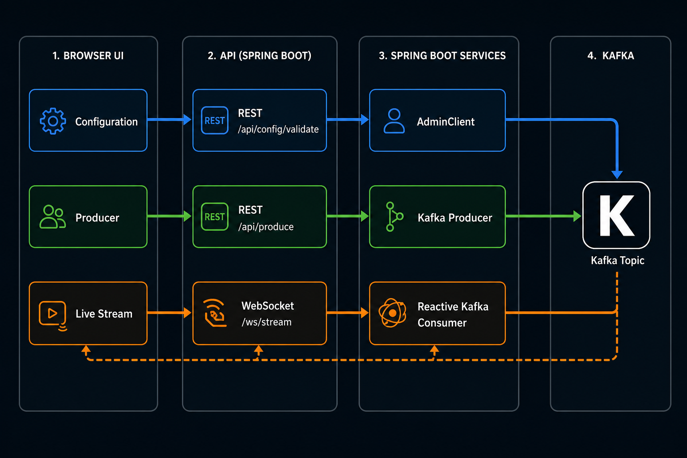

# Kafka Web Clients

Connect to a Kafka topic and produce and consume messages from your browser.

## Dataflow



## Features

- Connect to a Kafka cluster and topic from the web UI
- Produce messages to the topic
- Consume messages from the topic in real time

## Stack

- Spring WebFlux
- Reactor Kafka (`reactor-kafka`)
- WebSocket (`/ws/stream`) for live consumption
- REST API for config validation and message production

## Requirements

- Java 21+
- Maven 3.9+ (or generate the Maven Wrapper — see below)

## Get started

```bash
mvn spring-boot:run
```

Open [http://localhost:8080](http://localhost:8080).

### Maven Wrapper (`mvnw`)

`mvnw` is not installed globally. It is a project-local script that pins a Maven version for the repo.

If this project does not yet include `mvnw`, generate it from the project root:

```bash
mvn wrapper:wrapper
chmod +x mvnw
./mvnw spring-boot:run
```

### Install Maven (macOS)

```bash
brew install maven
mvn -version
```

## Usage

The UI is split into three panes: **Configuration**, **Producer**, and **Live Stream**.

1. In **Configuration**, enter **Kafka bootstrap servers** (e.g. `localhost:9092`), the **topic name**, and optional client properties (`key=value`, one per line) for SASL/SSL or other settings.
2. Click **Submit Config**. The app validates broker connectivity and that the topic exists. On success, the config form collapses and the Producer pane appears.
3. In **Live Stream**, click **Start Streaming** to open a WebSocket consumer and display incoming records.
4. In **Producer**, enter an optional message key and payload, then click **Send Message** to publish test records to the same topic.
5. Click **Stop Streaming** in the Live Stream pane to disconnect the consumer.

Use **Edit Config** (Configuration pane) to change settings when not streaming.

## REST API

### Validate config

`POST /api/config/validate`

```json
{
  "bootstrapServers": "localhost:9092",
  "topic": "my-topic",
  "additionalProperties": ""
}
```

Response:

```json
{ "valid": true, "message": "Connected to Kafka. Topic 'my-topic' exists with 1 partition(s)." }
```

```json
{ "valid": false, "error": "Could not connect to Kafka at localhost:9092. Check that the broker is running and reachable." }
```

### Produce message

`POST /api/produce`

```json
{
  "bootstrapServers": "localhost:9092",
  "topic": "my-topic",
  "additionalProperties": "",
  "key": "optional-key",
  "payload": "hello from browser"
}
```

Response:

```json
{
  "success": true,
  "message": "Message sent to partition 0 at offset 42.",
  "partition": 0,
  "offset": 42
}
```

```json
{ "success": false, "error": "Message payload is required" }
```

## WebSocket protocol

Endpoint: `ws://localhost:8080/ws/stream`

Client → server:

```json
{ "action": "start", "config": { "bootstrapServers": "...", "topic": "...", "additionalProperties": "" } }
{ "action": "stop" }
```

Server → client:

```json
{ "type": "status", "payload": "Streaming started" }
{ "type": "record", "key": "...", "payload": "...", "partition": 0, "offset": 42, "timestamp": 1710000000000 }
{ "type": "error", "error": "..." }
```

## Project layout

```
src/main/java/com/example/kafkawebclients/
  controller/   REST endpoints (config validation, produce)
  handler/      WebSocket streaming handler
  service/      Kafka consumer, producer, and connectivity services
  support/      Shared Kafka client property builder
  model/        Request/response and WebSocket message types
src/main/resources/static/index.html   Browser UI
```

## License

MIT — see [LICENSE](LICENSE).
